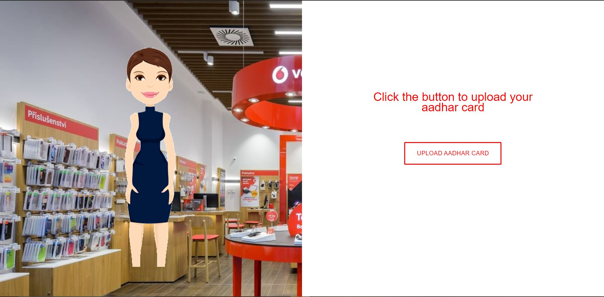

# Text-to-Speech-Web-App
A demo created for Vodafone Idea for Sim Card activation process on the web.

Tech Stack Used: Bootstrap, HTML5, CSS3, Tessaract OCR Engine, Google Text to Speech.

Application Snapshot:

